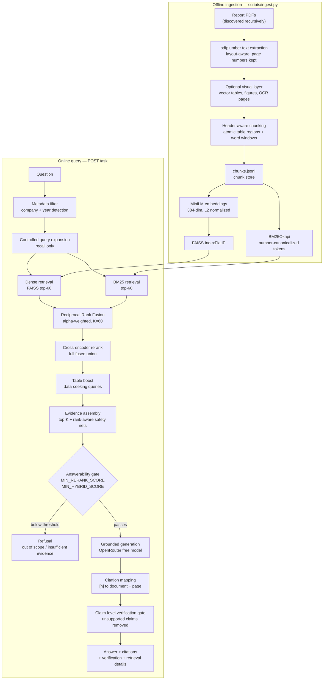

# Hybrid RAG for Financial Reports

Question answering over corporate ESG / sustainability reports that returns
**grounded answers, page-level citations, and a claim-by-claim verification
verdict** — or an explicit refusal when the reports do not contain the answer.

Retrieval combines **BM25 lexical search** and **dense vector search (FAISS)**
fused with **Reciprocal Rank Fusion**, refined by a **cross-encoder reranker**,
and every generated claim is checked against the evidence it cites before it is
allowed into the final answer.

## Live demo

| | URL |
| --- | --- |
| **Frontend** | https://hybrid-rag-frontend-fjdc.onrender.com/ |
| **Backend API** | https://hybrid-rag-7nsw.onrender.com |
| **Health check** | https://hybrid-rag-7nsw.onrender.com/health |

> Both services run on Render's free tier, so the first request after an idle
> period pays a cold start. Answer generation uses a free hosted model, which is
> rate-limited; when it is exhausted the API says so explicitly and retrieval
> still works.

---

## Problem statement

A question like *"What were Sasol's Scope 1 emissions in 2023?"* is hard for a
naive RAG system for reasons specific to this document type:

- **The answer lives in a table.** The value sits in a terse row
  (`Direct scope 1 58 644 57 284`) under year column headers, not in a fluent
  sentence. Embedding models and cross-encoders both prefer readable prose, so
  the row that actually holds the number gets ranked below narrative filler.
- **Exact figures are written inconsistently.** `64 392`, `64,392` and `63,4`
  are the same class of token rendered three ways. Naive tokenization splits
  `64 392` into `64` and `392`, so an exact-value query never lexically matches
  the row that answers it.
- **The corpus mixes seven unrelated companies.** Without scoping, a question
  about one company retrieves chunks from the other six and dilutes the context.
- **A wrong number is worse than no answer.** In a financial context, a
  confident hallucination or a citation that does not support its claim is a
  failure, not a rough edge.

This project targets those four problems specifically, and prefers refusing to
answer over guessing.

## Key features

- **Hybrid retrieval** — dense (FAISS) + BM25, fused by Reciprocal Rank Fusion
  so a strong single-retriever hit is never penalised to zero.
- **Cross-encoder reranking** — joint question–passage scoring over the full
  fused candidate union, using raw logits so answerability thresholds stay
  calibrated.
- **Table-aware retrieval** — number-dense rows are detected and promoted for
  data-seeking questions; tables are chunked atomically with their header
  lead-in so a value always travels with its metric label and year column.
- **Financial number normalization** — space-grouped, comma-grouped and comma-
  decimal figures are canonicalized identically at index and query time.
- **Metadata pre-filtering** — the company/year in a question is detected and
  retrieval is scoped to the matching report, with automatic relaxation so the
  filter can never empty the candidate pool.
- **Controlled query expansion** — a curated concept map widens *recall only*
  (dense + BM25); the reranker and the LLM always receive the original question.
- **Citation mapping** — every `[n]` marker is resolved back to a real chunk with
  a real document name and page number. Unmappable markers are discarded, never
  invented.
- **Claim-level verification gate** — each sentence is verified against the
  evidence it cites, including structured `year → value` relationship checks. A
  claim whose cited evidence does not support it is *removed from the answer*,
  so verification actually controls the output rather than decorating it.
- **Honest failure modes** — separate responses for out-of-scope questions,
  insufficient evidence, and LLM unavailability, each with a neutral
  verification state instead of a misleading red badge.
- **Full retrieval transparency** — every stage's scores and ranks (per-retriever
  score and rank, normalized scores, RRF score, rerank score, boost applied) are
  returned to the UI for inspection.
- **Memory-engineered serving** — runs inside a 512 MB instance via ONNX Runtime
  CPU inference, token-budgeted batching, and allocator tuning.

---

## Architecture



### Why each stage exists

| Stage | Implementation | Why it is there |
| --- | --- | --- |
| **Dense retrieval** | `all-MiniLM-L6-v2` (384-dim) → FAISS `IndexFlatIP` over L2-normalized vectors, so inner product equals cosine similarity | Finds passages that match the *meaning* of a paraphrased question |
| **BM25** | `rank_bm25.BM25Okapi` over a financial-aware tokenizer; **no embeddings involved** | Exact company names, metric labels, and figures that embeddings smooth over |
| **Hybrid fusion** | Reciprocal Rank Fusion, `1/(K + rank)` per retriever, alpha-weighted, `K=60` | Rank-based fusion is scale-free. Min-max score fusion assigns 0 to the missing modality, so a table row BM25 ranks #1 but the bi-encoder misses gets halved and suppressed. RRF only ever adds a positive contribution |
| **Cross-encoder rerank** | `ms-marco-MiniLM-L-6-v2`, raw logits (Identity activation), scored over the whole fused union | A bi-encoder embeds question and passage separately; a cross-encoder encodes them jointly and is far more precise. Too expensive for the corpus, so it only sees the candidate pool |
| **Table boost** | Constant logit boost on table/figure/number-dense chunks for data-seeking questions, then re-sort | The reranker systematically demotes terse numeric rows below fluent prose. The boost fixes *order*; the safety nets guarantee *presence* |
| **Evidence assembly** | Reranked top-K plus safety nets: top-N by fused rank, and top-N from each individual retriever | A noisy cross-encoder must not be able to drop a chunk that both retrievers ranked at the very top |
| **Answerability gate** | `MIN_RERANK_SCORE`, `MIN_HYBRID_SCORE` | Distinguishes out-of-scope from financial-but-unsupported, and refuses instead of hallucinating |
| **Generation** | OpenAI-compatible chat completions on OpenRouter, temperature 0, evidence-only system prompt with explicit table-reading rules | Grounded, cited, concise answers with no outside knowledge |
| **Citation mapping** | `[n]` markers resolved against the exact numbered evidence list handed to the model | Citations point at real chunks, real pages. Nothing is fabricated |
| **Verification gate** | Per-sentence lexical + numeric grounding, metric-label association, and structured `year → value` relationship checks | A citation existing is not enough; the cited evidence must support *that* claim. Unsupported claims are dropped from the answer |

### Grounding and failure behaviour

The pipeline is designed so that a wrong answer is harder to produce than no
answer:

- Retrieval metadata (chunk ids, page numbers, scores) is deliberately kept out
  of the model's context, so bookkeeping digits can never be echoed and scored
  as financial figures.
- A claim citing a figure that appears in the evidence but under a *different*
  metric label is capped at `PARTIALLY_SUPPORTED` rather than promoted.
- A claim asserting a `year → value` pair that contradicts a reconstructed table
  is `NOT_SUPPORTED` and is removed, even when both tokens appear in the text.
- If no claim survives verification, the answer becomes the insufficient-evidence
  message with no citations, rather than a partially-true statement.
- One controlled retry exists (a refusal or metadata echo despite strong
  evidence, re-prompted once with an evidence-focused suffix). There is no
  unbounded retry loop.

---

## Corpus

The knowledge base is a fixed set of ESG / sustainability report PDFs discovered
recursively under `DOCUMENTS_DIR`. No file names are hardcoded anywhere in the
pipeline.

| | |
| --- | --- |
| Source documents | **7** ESG / sustainability reports |
| Indexed chunks | **2,568** |
| Chunk content types | 1,623 narrative text · 935 table · 9 figure · 1 OCR page |
| Embedding dimension | 384 (`all-MiniLM-L6-v2`) |
| FAISS index | `IndexFlatIP`, 2,568 vectors (exact search) |

Reports currently indexed: Tongaat Hulett ESG 2021, Absa Group ESG Data Sheet
2022, Clicks Sustainability 2022, Distell ESG Appendix 2022, Impala Platinum ESG
2023, Pick n Pay ESG 2023, Sasol Sustainability 2023.

`Data_ret.csv` (1,440 distinct questions with ground-truth context passages) is
used **only** as an evaluation benchmark — it is never part of the retrieval
knowledge base.

> This is not a document-upload product. There is no upload or document
> management feature by design; the system answers over the provided corpus.

---

## Evaluation results

Retrieval is benchmarked by running each question through all four retrieval
configurations and comparing the retrieved chunks against the dataset's
ground-truth `Context` passage. Because chunks are re-derived from the PDFs with
different boundaries than the dataset's passages, a chunk counts as a **hit**
when at least 50% of the ground-truth context tokens appear in it.

Recorded in [`data/processed/evaluation.json`](data/processed/evaluation.json),
from a **200-question sample at K = 4**:

| Method | Recall@4 | Precision@4 | MRR | Hit Rate |
| --- | --- | --- | --- | --- |
| Dense | **0.360** | 0.1212 | 0.2313 | **0.360** |
| BM25 | 0.295 | 0.1212 | 0.2121 | 0.295 |
| Hybrid (RRF) | 0.345 | 0.1338 | 0.2544 | 0.345 |
| Hybrid + Cross-Encoder | 0.350 | **0.1363** | **0.2655** | 0.350 |

**Reading these numbers honestly:**

- Fusion and reranking improve **ranking quality**: MRR rises from 0.2313
  (dense) and 0.2121 (BM25) to 0.2655, and Precision@4 improves from 0.1212 to
  0.1363. The correct passage is placed higher when it is found.
- Fusion and reranking do **not** improve Recall@4 here — dense alone retrieves
  the ground-truth passage for 36.0% of questions versus 35.0% for the full
  pipeline. Hybrid fusion trades a small amount of top-4 recall for better
  ordering and better precision.
- Absolute recall is modest across every method. The dominant cause is the
  strict 50%-token-overlap hit criterion combined with chunk boundaries that do
  not align with the dataset's ground-truth passages: a chunk can contain the
  answer and still not be scored as a hit. These figures are best read as a
  *relative comparison between retrieval strategies*, not as end-to-end answer
  accuracy.
- Answer-level accuracy (faithfulness) is **not** measured. See
  [Limitations](#limitations-and-future-work).

Reproduce with `python scripts/evaluate.py --sample 200`. Nothing displayed in
the UI is hardcoded; the Evaluation page reads this generated file.

---

## API

Interactive OpenAPI docs: `/docs` (e.g.
[live](https://hybrid-rag-7nsw.onrender.com/docs)).

| Method | Path | Description |
| --- | --- | --- |
| `GET` | `/health` | Service status, LLM reachability and model name, whether indexes loaded, and process resident memory |
| `POST` | `/ask` | Body `{ "question": "...", "company": "...", "year": 2023 }` (`company`/`year` optional) → answer, citations, verification, full retrieval details |
| `GET` | `/evaluation` | Corpus statistics plus the Dense / BM25 / Hybrid / Hybrid+Cross-Encoder metrics |

`GET /health`:

```json
{
  "status": "ok",
  "llm": {
    "reachable": true,
    "model_available": true,
    "model": "inclusionai/ling-3.0-flash-fin:free",
    "available_models": [],
    "num_available_models": 437
  },
  "indexes_loaded": true,
  "memory_mb": 363.3
}
```

`memory_mb` is the serving process's resident memory, exposed so an
out-of-memory restart can be diagnosed from outside. It should settle and stay
flat across requests.

`POST /ask` response shape:

```json
{
  "answer": "… grounded sentence with markers [1] …",
  "citations": [
    {
      "citation_id": 1,
      "document_name": "Sasol Sustainability Report 2023",
      "page_number": 41,
      "chunk_id": "…",
      "supporting_text": "…",
      "content_type": "table",
      "visual_ref": null
    }
  ],
  "verification": {
    "overall_status": "SUPPORTED",
    "summary": "Every factual claim is supported by its cited evidence.",
    "per_citation": [
      {
        "citation_id": 1,
        "status": "SUPPORTED",
        "coverage": 0.62,
        "numbers_matched": true,
        "reason": "numeric and semantic grounding"
      }
    ]
  },
  "retrieval_details": { "dense_results": [], "bm25_results": [], "hybrid_results": [], "reranked_results": [] },
  "llm_available": true,
  "status": "ok"
}
```

`status` is one of `ok`, `insufficient_evidence`, `out_of_scope`,
`no_candidates`, or `llm_unavailable`. Note that `/ask` returns **200** for a
refusal or an unavailable LLM — the outcome is carried in `status` and
`llm_available`, with `verification.overall_status` set to `NOT_APPLICABLE` so
the UI does not show a misleading failure badge.

---

## Tech stack

**Retrieval and ranking**
- FAISS (`faiss-cpu`) — exact inner-product vector index
- `rank_bm25` (BM25Okapi) — lexical retrieval
- `sentence-transformers/all-MiniLM-L6-v2` — embeddings (384-dim)
- `cross-encoder/ms-marco-MiniLM-L-6-v2` — reranking
- **ONNX Runtime (CPU)** — both models run from their official fp32 ONNX exports
  via `tokenizers` + `huggingface-hub`, so PyTorch is not installed in the
  serving process. Identical weights means the same vector space and the same
  logit scale, so existing indexes and thresholds stay valid.

**Generation**
- OpenRouter OpenAI-compatible chat completions, free model
  (`inclusionai/ling-3.0-flash-fin:free` by default), temperature 0. Model, base
  URL and API key are all environment-driven.

**Backend**
- FastAPI · Pydantic v2 · Uvicorn · `requests` · `python-dotenv`

**Frontend**
- React 18 · Vite 5 · Tailwind CSS 3

**Ingestion and evaluation (offline only)**
- `pdfplumber` (text + vector tables) · `PyMuPDF` (page rendering, figure
  detection) · `pytesseract` (optional OCR) · `pandas` · `pytest` + `httpx`

Retrieval, reranking and verification run entirely locally on CPU. Only answer
generation calls a hosted API, and it uses a free model.

---

## Project structure

```
.
├── backend/
│   ├── main.py                     # FastAPI app: /health, /ask, /evaluation
│   ├── config.py                   # env-driven settings (single source of truth)
│   ├── rag_engine.py               # pipeline orchestration
│   ├── runtime.py                  # allocator/thread tuning, memory release
│   ├── batching.py                 # batch × seq² token-budget batch planning
│   ├── text_normalize.py           # number canonicalization, metadata scrubbing
│   ├── api/schemas.py              # Pydantic request/response models
│   ├── ingestion/
│   │   ├── pdf_loader.py           # page text extraction (layout-aware)
│   │   ├── visual.py               # tables, figures, OCR (opt-in)
│   │   ├── chunker.py              # header-aware atomic table chunking
│   │   └── pipeline.py             # PDFs → chunks → FAISS + BM25
│   ├── embeddings/embedder.py      # ONNX embedding model, mean pooling + L2
│   ├── retrieval/
│   │   ├── store.py                # chunk store + per-chunk metadata
│   │   ├── dense.py                # FAISS search + index build
│   │   ├── bm25.py                 # BM25 + financial tokenizer
│   │   ├── hybrid.py               # Reciprocal Rank Fusion
│   │   ├── metadata.py             # company/year detection and filtering
│   │   └── query_expansion.py      # curated recall-only expansion
│   ├── reranking/reranker.py       # ONNX cross-encoder (raw logits)
│   ├── citations/
│   │   ├── mapper.py               # [n] → document + page
│   │   ├── verifier.py             # claim-level verification gate
│   │   └── table_relations.py      # year → value relationship checks
│   ├── generation/llm.py           # OpenRouter client + grounding prompt
│   └── evaluation/evaluator.py     # retrieval benchmark
├── frontend/
│   └── src/
│       ├── App.jsx                 # shell, nav, LLM status indicator
│       ├── api.js                  # API client
│       ├── pages/Ask.jsx           # question, answer, citations
│       ├── pages/Evaluation.jsx    # corpus stats + metrics
│       └── components/             # RetrievalDetails, VerificationBadge, About
├── scripts/
│   ├── ingest.py                   # build indexes  (--force to rebuild)
│   └── evaluate.py                 # run benchmark  (--sample N | --full)
├── tests/                          # pytest suite (9 modules)
├── data/
│   ├── processed/chunks.jsonl      # chunk store (committed)
│   ├── processed/evaluation.json   # benchmark results (committed)
│   └── indexes/{faiss,bm25}/       # search indexes (committed)
├── render.yaml                     # deployment blueprint + memory settings
├── requirements.txt                # serving dependencies only
├── requirements-offline.txt        # + ingestion, evaluation, tests
└── .env.example
```

---

## Local setup

### Prerequisites

Python 3.10+, Node 18+, and an [OpenRouter API key](https://openrouter.ai/keys)
(free tier is sufficient).

### 1. Backend

```bash
python -m venv .venv
.venv\Scripts\activate          # Windows
source .venv/bin/activate       # macOS / Linux

pip install -r requirements-offline.txt
```

Dependencies are split in two because the deployed service is memory-bound:

| File | Contents | Used by |
| --- | --- | --- |
| `requirements.txt` | only what the API needs to answer a question | the deployed service |
| `requirements-offline.txt` | the above plus `pdfplumber`, `PyMuPDF`, `pytesseract`, `pandas`, `pytest` | ingestion, evaluation, tests |

Ingestion and evaluation run locally and write into `data/`, so the server never
needs their dependencies. Excluding them keeps roughly 117 MB of imports out of
the serving process.

### 2. Environment

```bash
cp .env.example .env            # Windows: copy .env.example .env
```

Set `OPENROUTER_API_KEY` in `.env`. The file is gitignored and the key is only
ever read from the environment.

### 3. Indexes

The FAISS, BM25 and chunk-store artifacts are **committed to the repository**, so
the API runs immediately after install. Rebuild them only when the source PDFs or
the chunking configuration change:

```bash
python scripts/ingest.py            # reuses existing artifacts
python scripts/ingest.py --force    # full rebuild
```

Rebuilding requires the PDFs under `DOCUMENTS_DIR` and the offline dependencies.
OCR additionally requires the Tesseract engine binary; if it is missing, OCR is
skipped gracefully and table/text extraction still works.

### 4. Run

```bash
uvicorn backend.main:app --reload      # http://localhost:8000  (docs at /docs)
```

```bash
cd frontend
npm install
npm run dev                            # http://localhost:5173
```

Vite proxies `/api` → `http://localhost:8000` in development, so no CORS setup
is needed locally.

### 5. Optional: refresh the benchmark

```bash
python scripts/evaluate.py --sample 200     # or --full for all 1,440 questions
```

---

## Environment variables

All configuration is environment-driven via `backend/config.py`; nothing
important is hardcoded elsewhere. See [`.env.example`](.env.example) for the
complete annotated list. The most relevant:

| Variable | Default | Purpose |
| --- | --- | --- |
| `OPENROUTER_API_KEY` | *(empty)* | OpenRouter key. Empty means generation is disabled and reported via `/health` instead of crashing |
| `LLM_MODEL` | `inclusionai/ling-3.0-flash-fin:free` | Generation model |
| `LLM_BASE_URL` | `https://openrouter.ai/api` | API base URL |
| `LLM_TIMEOUT` / `LLM_TEMPERATURE` | `120` / `0.0` | Request timeout (s) and sampling temperature |
| `EMBEDDING_MODEL` | `sentence-transformers/all-MiniLM-L6-v2` | Must match the model the FAISS index was built with (enforced at load) |
| `RERANKER_MODEL` | `cross-encoder/ms-marco-MiniLM-L-6-v2` | Cross-encoder |
| `TOP_K_DENSE` / `TOP_K_BM25` / `TOP_K_HYBRID` | `60` | Retrieve wide, rerank narrow |
| `RERANK_TOP_K` | `6` | Evidence items sent to the LLM |
| `HYBRID_ALPHA` / `RRF_K` | `0.5` / `60` | Dense/BM25 weighting and the RRF constant |
| `HYBRID_SAFETY_TOP_K` / `MODALITY_SAFETY_TOP_K` | `5` / `3` | Rank-aware safety nets |
| `MIN_RERANK_SCORE` / `MIN_HYBRID_SCORE` | `-4.0` / `0.15` | Answerability thresholds |
| `VERIFY_SUPPORTED_THRESHOLD` / `VERIFY_PARTIAL_THRESHOLD` | `0.45` / `0.2` | Verification coverage thresholds |
| `ENABLE_TABLE_RERANK_BOOST` / `TABLE_RERANK_BOOST` | `true` / `2.0` | Table promotion for data-seeking queries |
| `ENABLE_QUERY_EXPANSION` | `true` | Recall-only query expansion |
| `ENABLE_METADATA_FILTER` | `true` | Company/year scoping |
| `ENABLE_VISUAL_INGEST` | `false` | Opt-in table / figure / OCR ingestion (the committed index was built with this enabled) |
| `RERANK_TOKEN_BUDGET` / `EMBED_TOKEN_BUDGET` | `262144` | `batch × seq²` inference memory budgets |
| `MAX_REQUEST_THREADS` | `2` | Cap on the sync-endpoint thread pool |
| `RETRIEVAL_DEBUG` | `false` | Per-stage trace logging |

The frontend reads one build-time variable, `VITE_API_URL`, which points at the
backend in production; it falls back to the `/api` dev proxy when unset.

---

## Deployment

Both services are deployed on Render.

**Backend** — Python web service defined by
[`render.yaml`](render.yaml), health-checked at `/health`. The build installs
only `requirements.txt`; it deliberately does **not** run ingestion, because the
indexes are committed and ingestion's dependencies are not installed at serving
time. `OPENROUTER_API_KEY` is set as a dashboard secret (`sync: false`).

**Frontend** — Render static site (configured in the dashboard rather than in
`render.yaml`), built with `npm run build` and served from `frontend/dist`, with
`VITE_API_URL` pointed at the backend. The backend's CORS policy explicitly
allows the deployed frontend origin plus `localhost:5173`.

### Memory engineering

The service is memory-bound, not CPU-bound, and fits in a 512 MB instance only
because of the settings in `render.yaml`:

| Component | Resident |
| --- | --- |
| Python + FastAPI + Uvicorn + Pydantic | ~46 MB |
| NumPy + faiss + ONNX Runtime | ~36 MB |
| Chunk store + FAISS index + BM25 index | ~24 MB |
| Embedder ONNX session (fp32) | ~108 MB |
| Cross-encoder ONNX session (fp32) | ~95 MB |
| **Steady-state baseline** | **~310 MB** |

- **`--workers 1` matters most.** Each Uvicorn worker is a full copy of the model
  sessions, so two workers double the baseline to ~620 MB and the instance is
  killed on startup.
- **`--limit-concurrency`** sheds excess load with a 503 rather than running out
  of memory, so a spike degrades instead of restarting the service.
- **`MAX_REQUEST_THREADS`** caps Starlette's sync-endpoint pool (default 40).
  Each in-flight request holds its own candidate pool and response tree.
- **Token-budgeted batching** bounds inference on `batch × seq²`, because
  attention memory grows with the *square* of sequence length. A fixed batch of
  16 padded to 512 tokens allocates ~192 MB for one tensor; the same budget keeps
  it near 12 MB. Scores are unaffected — padding is excluded by the attention
  mask.
- **`MALLOC_ARENA_MAX=2`** plus an explicit post-request heap trim stops glibc
  from parking freed memory in per-thread arenas, which is what makes resident
  memory climb request after request and look like a leak.
- **Lazy imports.** `pandas` (~44 MB) is imported inside the `/evaluation`
  handler, never at module scope, and `/health` and `/evaluation` are both cached
  so repeated polling does not re-parse large documents.

Measured effect: ~310 MB baseline, and ~370 MB peak under 12-way concurrent load
instead of ~520 MB. If the service was created from the dashboard rather than
from this blueprint, the build and start commands must be copied there by hand —
the dashboard's stored commands take precedence over the blueprint.

---

## Testing

```bash
python -m pytest tests
```

Nine test modules cover PDF ingestion and chunking, dense / BM25 / hybrid
retrieval, reranking, number normalization, numeric-semantic grounding, citation
mapping and verification, year→value relationship checks, retrieval-metadata leak
prevention, and the three API endpoints. Tests that need indexes are skipped when
the artifacts are absent.

---

## Limitations and future work

**Known limitations**

- **Retrieval metrics only.** Recall/Precision/MRR/Hit Rate measure retrieval.
  Answer-level faithfulness and correctness are not benchmarked, so the
  end-to-end answer accuracy is not quantified.
- **The hit criterion is strict and boundary-sensitive.** A chunk can contain the
  answer without reaching 50% token overlap with the dataset's ground-truth
  passage, which depresses absolute recall for every method.
- **Verification is lexical, not entailment-based.** It combines token overlap,
  numeric grounding, metric-label association and table-relationship checks —
  effective for figures, but it is not an NLI model and can misjudge paraphrase.
- **Free-tier generation is rate-limited.** The free OpenRouter model returns HTTP
  429 under load; the API surfaces this explicitly rather than retrying, and
  retrieval remains inspectable when it happens.
- **Cold starts.** Both Render free-tier services sleep when idle.
- **Exact FAISS search.** `IndexFlatIP` is exhaustive — correct and simple at
  2,568 vectors, but it does not scale to large corpora.
- **Fixed corpus.** No upload or document management; the index is rebuilt
  offline and committed.

**Planned improvements**

- Answer-level faithfulness evaluation alongside the retrieval benchmark.
- A resilience layer for free-tier generation (server-side fallback across free
  models) so a single rate-limited provider does not block an answer.
- Approximate FAISS index (IVF / HNSW) for larger corpora.
- fp16 / int8 ONNX exports to halve the ~200 MB of model weights, which requires
  rebuilding the FAISS index and re-calibrating `MIN_RERANK_SCORE`.
- Streaming token responses for faster perceived latency.
- Surfacing `visual_ref` page images in the UI so a table citation links to the
  rendered source page.
